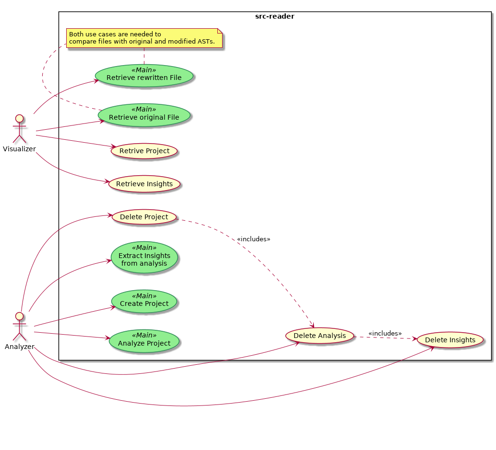

# src-reader

Another tool for static source code analysis.

**src-reader** allows you to perform static analysis of source code, focusing primarily on the identifiers names. A measure of source code quality can be calculated from the analysis performed on the identifiers, based on how descriptive they are.

The tool main use cases allows you to:

* **Clone** a GitHub repository.
* **Parse** each _*.go_ file to generate its Abstract Syntax Tree.
* **Pre-process** each AST to create the input needed by the splitting/expansion algorithms.
* **Process** each AST, applying a set of pre-defined algorithms for splitting and expansion. Currently, only a subset of identifiers is considered valuable (package functions, variables, struct, interfaces and constants). Local variables are not analyzed.
* **Extract** insights from the identifiers that are considered valuable, and determine the project's quality level.
* **Modify** an AST with the best applicable identifier names and generate a new file.

_Currently, the only supported language is Golang._

## Features

## Architecture Overview

_WIP_

## License

See the [LICENSE](LICENSE) file for license rights and limitations (MIT).
